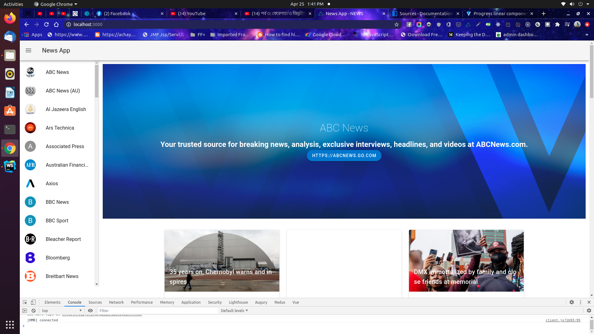

# NEWS APP

> Basic API connection application  

## Project Overview



## Setup Your Free API Key

> Sign up [News API](https://newsapi.org/) backend server and generate Api Key.

> Open [nuxt.config.js](./nuxt.config.js) and configure axios header

```
axios: {
    headers: {
      'X-Api-Key': 'apiKey'
      // OR
      // Authorization: ''
    },
    baseURL: 'https://newsapi.org/v2/'
  }
```


## Build Setup

```bash
# install dependencies
$ yarn install

# serve with hot reload at localhost:3000
$ yarn dev

# build for production and launch server
$ yarn build
$ yarn start

# generate static project
$ yarn generate
```

For detailed explanation on how things work, check out [Nuxt.js docs](https://nuxtjs.org).
